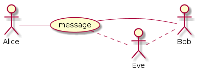
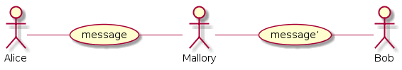
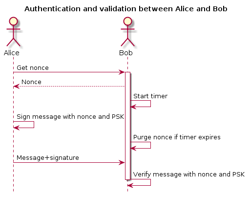
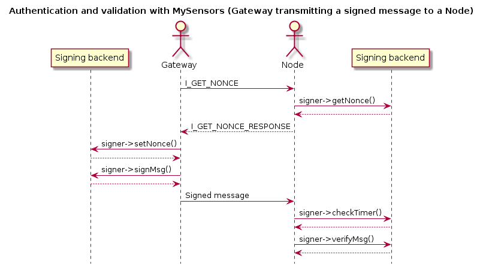
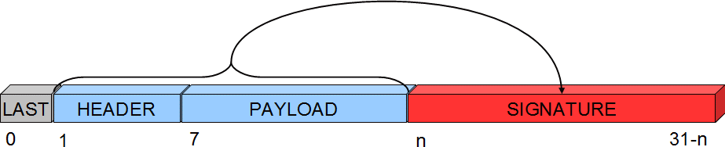
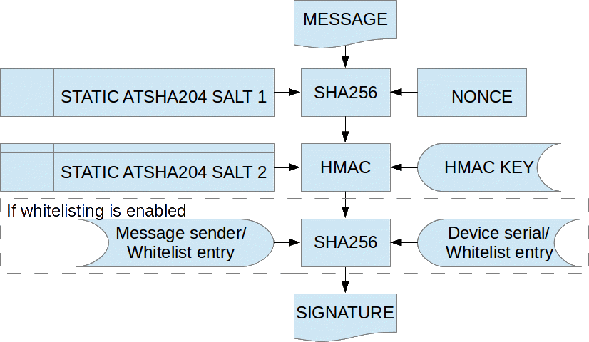

Security
========

Signing support has now been implemented and is available from release 1.5 of the 
MySensors library.Since doxygen documentation is not yet available for the master 
branch from which releases really made, I have documented signing support in this 
post. If you use the development branches, I strongly urge you to read the "live" 
documentation which is available here. You can find the signing documentation under "modules" and "MySensors internal APIs and functionalities > MySigning".

In an effort to normalize the technical playing field for all forum members I will 
describe what this means, and why it is important. And I will also briefly touch 
on the generic concept of authentication and verification, motivate the need for 
this (and explain why encryption is not part of this) and go on to explain the 
architecture used for MySensors and how to enable and use this new feature.

Background and concepts
***********************

Suppose two participants, Alice and Bob, wants to exchange a message. Alice sends 
a message to Bob. In MySensors “language” Alice could be a gateway and Bob an 
actuator (light swich, electronic lock, etc). But to be generic, we will 
substitute the term “gateway” with Alice and a “node” with Bob (although the 
reverse relationship is also supported).

Alice sends a message to Bob. This message can be heard by anyone who wants to 
listen (and also by anyone that is within “hearing” distance). Normally, this is 
perhaps not a big issue. Nothing Alice says to Bob may be secret or sensitive in any way.

However, sometimes (or perhaps always) Bob want to be sure that the message Bob 
receives actually came from Alice. In cryptography, this is known as authenticity. 
Bob need some way of determining that the message is authentic from Alice, when 
Bob receives it. This prevent an eavesdropper, Eve, to trick Bob into thinking it 
was Alice that sent a message Eve in fact transmitted. Bob also need to know how 
to determine if the message has been repeated. Eve could record a message sent by 
Alice that Bob accepted and then send the same message again. Eve could also in 
some way prevent Bob from receiving the message and delay it in order to permit 
the message to arrive to Bob at a time Eve chooses, instead of Alice. Such an 
attack is known as a **replay attack**. *Authenticity* permits Bob to determine 
if Alice is the true sender of a message.

It can also be interesting for Bob to know that the message Alice sent has not 
been tampered with in any way. This is the *integrity* of the message. We now 
introduce Mallory, who could be intercepting the communication between Alice 
and Bob and replace some parts of the message but keeping the parts that 
authenticate the message. That way, Bob still trusts Alice to be the source, but 
the contents of the message was not the content Alice sent. Bob needs to be able 
to determine that the contents of the message was not altered after Alice sent it.

Mallory would in this case be a **man-in-the-middle** attacker.

*Integrity* permits Bob to verify that the messages received from Alice has not 
been tampered with. This is achieved by adding a signature to the message, which 
Bob can inspect to validate that Alice is the author.

The signing scheme used, needs to address both these attack scenarios. Neither 
Eve nor Mallory must be permitted to interfere with the message exchange between 
Alice and Bob.

The key challenge to implementing a secure signing scheme is to ensure that every 
signature is different, even if the message is not. If not, **replay attacks** 
would be very hard to prevent.

One way of doing this is to increment some counter on the sender side and include 
it in the signature. This is however predictable.

A better option would be to introduce a random number to the signature. That way, 
it is impossible to predict what the signature will be. The problem is, that also 
makes it impossible for the receiver (Bob) to verify that the signature is valid. 
A solution to this is to let Bob generate the random number, keep it in memory 
and send it to Alice. Alice can then use the random number in the signature 
calculation and send the signed message back to Bob who can validate the 
signature with the random number used. This random number is in cryptography 
known as a `nonce <http://en.wikipedia.org/wiki/Cryptographic_nonce>`_ or 
`salt <http://en.wikipedia.org/wiki/Salt_%28cryptography%29>`_.

However, Mallory might be eavesdropping on the communication and snoop up the 
nonce in order to generate a new valid signature for a different message. To 
counter this, both Alice and Bob keep a secret that only they know. This secret 
is never transmitted over the air, nor is it revealed to anybody. This secret 
is known as a pre-shared key (PSK).

If Even or Mallory are really sophisticated, he/she might use a **delayed replay 
attack**. This can be done by allowing Bob to transmit a nonce to Alice. But when 
Alice transmits the uniquely signed message, Mallory prevents Bob from receiving 
it, to a point when Mallory decides Bob should receive it. An example of such an 
attack is described `here <http://spencerwhyte.blogspot.se/2014/03/delay-attack-
jam-intercept-and-replay.html>`_. This needs to be addressed as well, and one way 
of doing this is to have Bob keep track of time between a transmitted nonce and 
a signed message to verify. If Bob is asked for a nonce, Bob knows that a signed 
message is going to arrive “soon”. Bob can then decide that if the signed message 
does not arrive within a predefined timeframe, Bob throws away the generated nonce 
and thus makes it impossible to verify the message if it arrives late.

The flow can be described like this:

The benefits for MySensors to support this are obvious. Nobody wants others to 
be able to control or manipulate any actuators in their home.

Why encryption is not part of this
**********************************

Well, some could be uncomfortable with somebody being able to snoop temperatures, 
motion or the state changes of locks in the environment. Signing does **not** 
address these issues. *Encryption* is needed to prevent this.

It is my personal standpoint that encryption should not be part of the MySensors 
“protocol”. The reason is that a gateway and a node does not really care about 
messages being readable or not by “others”. It makes more sense that such 
guarantees are provided by the underlying transmission layer (RF solution in this 
case). It is the information transmitted over the air that needs to be secret 
(if user so desires). The “trust” level on the other hand needs to go all the way 
into the sketches (who might have different requirements of trust depending on 
the message participant), and for this reason, it is more important (and less 
complicated) to ensure authenticity and integrity at protocol-level as message 
contents is still readable throughout the protocol stack. But as soon as the 
message leaves the “stack” it can be scramble into “garbage” when transmitted 
over the air and then reassembled by a receiving node before being fed in “the 
clear” up the stack at the receiving end.

There are methods and possibilities to provide encryption also in software, but 
if this is done, it is my recommendation that this is done after integrity- and 
authentication information has been provided to the message (if this is desired). 
Integrity and authentication is of course not mandatory and some might be happy 
with only having encryption to cover their need for security. I, however, have 
only focused on integrity and authenticity while at the same time keeping the 
current message routing mechanisms intact and therefore leave the matter of 
secrecy to be implemented in the “physical” transport layer. With the integrity 
and authenticity handled in the protocol it ought to be enough for a simple 
encryption (nonce-less AES with a PSK for instance) on the message as it is sent 
to the RF backend. Atmel does provide such circuits as well but I have not 
investigated the matter further as it given the current size of the ethernet 
gateway sketch is close to the size limit on an Arduino Nano, so it will be 
difficult to fit this into some existing gateway designs.

Also it is worth to consider that the state of a lock can just as readily be 
determined by simply looking at the door in question or attempting to open it, 
so obfuscating this information will not necessarily deter an attacker in any way. 
Nevertheless, I do acknowledge that people find the fact that all information is 
sent “in the clear” even if it require some technical effort for an intruder to 
obtain and inspect this information. So I do encourage the use of encrypting 
transport layers.

This is however not covered by this topic nor my implementation.

How this is done
****************

There exist many forms of message signature solutions to combat Eve and Mallory.
Most of these solutions are quite complex in term of computations, so I elected 
to use an algorithm that an external circuit is able to process. This has the 
added benefit of protecting any keys and intermediate data used for calculating 
the signature so that even if someone were to actually steal a sensor and 
disassembled it, they would not be able to extract the keys and other information 
from the device.

A common scheme for message signing (authenticity and integrity) is implemented 
using HMAC which in combination with a strong hash function provides a very 
strong level of protection.

The Atmel ATSHA204A is a low-cost, low-voltage/current circuit that provides HMAC 
calculation capabilities with SHA256 hashing which is a (currently) virtually 
unbreakable combination. If SHA256 were to be hacked, a certain cryptocurrency 
would immediately be rendered worthless. The ATSHA device also contain a random 
number generator (RNG) which enables the generation of a good nonce, as in, 
non-predictable. As I acknowledge that some might not want to use an additional 
external circuit, I have also implemented a software version of the ATSHA device, 
capable of generating the same signatures as the ATSHA device does. Because it is 
pure-software however, it does not provide as good nonces (it uses the Arduino 
pseudo-random generator) and the HMAC key is stored in SW and is therefore 
readable if the memory is dumped. It also naturally claims more flash space due 
to the more complex software. But for indoor sensors/actuators this might be good 
enough for most people.

How to use this
***************

Before we begin with the details, I just want to emphasize that signing is 
completely optional and although it is enabled by default, it will use a default 
backend that does not require signing and does not enforce signature checks. 
However, if you really do not want any additional "cost" in program space related 
to signing, you can disable MY_SIGNING_FEATURE in MyConfig.h.

**Firstly**, you need to make sure MY_SIGNING_FEATURE is enabled in MyConfig.h. 
You then select which backend to use by passing the appropriate handle when 
constructing the MySensor object. The handle is passed as the third argument 
(example here uses the real ATSHA without whitelisting):

.. code-block:: cpp

    #include <MySigningAtsha204.h>

    MyTransportNRF24 radio;  // NRFRF24L01 radio driver
    MyHwATMega328 hw; // Select AtMega328 hardware profile
    MySigningAtsha204 signer; // Select HW ATSHA signing backend

    MySensor gw(radio, hw, signer);

If the software equivalent if the ATSHA is desired instead do

.. code-block:: cpp

    #include <MySigningAtsha204Soft.h>

    MyTransportNRF24 radio;  // NRFRF24L01 radio driver
    MyHwATMega328 hw; // Select AtMega328 hardware profile

    // Change the soft_serial value to an arbitrary value for proper security
    uint8_t soft_serial[SHA204_SERIAL_SZ] = {0x01,0x02,0x03,0x04,0x05,0x06,0x07,0x08,0x09};
    MySigningAtsha204Soft signer(true, 0, NULL, soft_serial);  // Select SW ATSHA signing backend

    MySensor gw(radio, hw, signer);

It is legal to mix :code:`MySigningAtsha204` and :code:`MySigningAtsha204Soft` 
backends in a network. They work together.

**Secondly**, you need to verify the configuration for the backend. Currently, 
only :code:`MySigningAtsha204` and :code:`MySigningAtsha204Soft` backends have a 
specific configuration. For MySigningAtsha204 it is the pin the device is 
connected to. In :code:`MyConfig.h` there are defaults for sensors and gateways 
which you might need to adjust to match your personal build. The setting is 
defined using MY_ATSHA204_PIN and the default is to use pin A3. For 
:code:`MySigningAtsha204Soft`, an unconnected analog pin is required to set a 
random seed for the pseudo-random generator. It is important that the pin is 
floating, or the output of the pseudo-random generator will be predictable, and 
thus compromise the signatures. The setting is defined using 
:code:`MY_RANDOMSEED_PIN` and the default is to use pin A7.

**Thirdly**, if you use the :code:`MySigningAtsha204Soft` backend, you need to 
create/set a HMAC key to use. This key is 32 bytes wide and should be an 
arbitrarily chosen value. A string is OK, but as this key never needs to be 
“parsed” a completely random number is recommended. The key is stored in our 
sketch and is passed when constructing the :code:`MySigningAtsha204Soft` object.

If you use the “real” ATSHA204A, before any signing operations can be done, the 
device needs to be personalized. This can be a daunting process as it involves 
irreversibly writing configurations to the device, which cannot be undone. I 
have however tried to simplify the process as much as possibly by creating a 
helper-sketch specifically for this purpose in 
libraries/MySensors/examples/Sha204Personalizer/sha204_personalizer.ino

The process of personalizing the ATSHA204A involves

- Writing and locking chip configuration
- (optionally) Generating and (mandatory) writing HMAC key
- (optionally) Locking data sections

First execute the sketch without modifications to make sure communications with 
the device can be established. It is highly recommended that the first time this 
is done, a device with serial debug possibilities is used. When this has been 
confirmed, it is time to decide what type of personalization is desired. There 
are a few options here.

Firstly, enable :code:`LOCK_CONFIGURATION` to allow the sketch to lock the chip 
configuration. The sketch will write the default settings to the chip because 
these are fine for our purposes. This also enables the RNG which is required to 
allow the sketch to automatically generate a PSK if this is desired. Now it is 
possible to execute the sketch to lock the configuration and enable the RNG.

Next step is to decide if a new key should be generated or an existing key should 
be stored to the device. This is determined using :code:`USER_KEY_DATA`, which, 
if defined, will use the data in the variable user_key_data. If 
:code:`USER_KEY_DATA` is disabled, the RNG will be used to generate a key. This 
key obviously need to be made available to you so you can use it in other devices 
in the network, and this key is therefore also printed on the serial console when 
it has been generated. The key (generated or provided) will be written to the 
device unless :code:`SKIP_KEY_STORAGE` is set. As long as the data zone is kept 
unlocked the key can be replaced at any time. However, Atmel suggests the data 
region to be locked for maximum security. On the other hand, they also claim 
that the key is not readable from the device even if the data zone remains 
unlocked so the need for locking the data region is optional for MySensors usage.

For devices that does not have serial debug possibilities, it is possible to set 
:code:`SKIP_UART_CONFIRMATION`, but it is required to set :code`USER_KEY_DATA` 
if this option is enabled since a generated and potentially unknown key could be 
written to the device and thus rendering it useless (if the data zone is also 
locked).

For devices with serial debug possibilities it is recommended to not use 
:code:`SKIP_UART_CONFIRMATION` as the sketch without that setting will ask user 
to send a "space" character on the serial terminal before any locking operations 
are executed as an additional confirmation that this irreversible operation is 
done. However, if a number of nodes are to undergo personalization, this option 
can be enabled to streamline the personalization.
This is a condensed description of settings to fully personalize and lock down a 
set of sensors (and gateways): Pick a “master” device with serial debug port.

Set the following sketch configuration of the personalizer:
   
| Enable :code:`LOCK_CONFIGURATION`
| Disable :code:`LOCK_DATA`
| Enable :code:`SKIP_KEY_STORAGE`
| Disable :code:`SKIP_UART_CONFIGURATION`
| Disable :code:`USER_KEY_DATA`

Execute the sketch on the “master” device to obtain a randomized key. Save this 
key to a secure location and keep it confidential so that you can retrieve it if 
you need to personalize more devices later on.

Now reconfigure the sketch with these settings:

| Enable :code:`LOCK_CONFIGURATION`
| Enable :code:`LOCK_DATA` (if you are sure you do not need to replace/revoke the key, this is the most secure option to protect from key readout according to Atmel, but they also claim that key is not readable even if data region remains unlocked from the slot we are using)
| Disable SKIP_KEY_STORAGE
| Enable SKIP_UART_CONFIGURATION
| Enable USER_KEY_DATA
| Put the saved key in the user_key_data variable.

Now execute the sketch on all devices you want to personalize with this secret 
key. That’s it. Personalization is done and the device is ready to execute 
signing operations which are valid only on your personal network.

In case you want to be able to "whitelist" trusted nodes (in order to be able to 
revoke them in case they are lost) you also need to take note of the serial 
number of the ATSHA device. This is unique for each device. The serial number 
is printed in a copy+paste friendly format by the personalizer for this purpose.

Signing in the MySensors network is driven from the receiving nodes. That means, 
if a node require signing it will inform the gateway of this. To instruct a node 
to require signing by the gateway, provide a suitable backend to the library 
constructor. Both MySigningAtsha204 and MySigningAtsha204Soft backends will 
by-default require signing when used. The default constructors for these backends 
can be overridden to disable signing requirements if the node does not require 
signed messages but still need the ability to verify messages (like a gateway).

Example for a node that uses ATSHA and require signing:

.. code-block:: cpp
    
    #include <MySigningAtsha204.h>
    MyTransportNRF24 radio;  // NRFRF24L01 radio driver
    MyHwATMega328 hw; // Select AtMega328 hardware profile
    MySigningAtsha204 signer; // Select ATSHA204A physical signing circuit
    MySensor gw(radio, hw, signer);

Example for a gateway that uses ATSHA signing in software and do not require signing from nodes:

.. code-block:: cpp

    #include <MySigningAtsha204Soft.h>
    MyTransportNRF24 radio;  // NRFRF24L01 radio driver
    MyHwATMega328 hw; // Select AtMega328 hardware profile
    uint8_t soft_serial[SHA204_SERIAL_SZ] = {0x01,0x02,0x03,0x04,0x05,0x06,0x07,0x08,0x09};
    MySigningAtsha204Soft signer(false, 0, NULL, soft_serial);  // Select ATSHA204A software signing backend
    MySensor gw(radio, hw, signer);

If a node does require signing, any unsigned message sent to the node will be 
rejected. This also applies to the gateway. However, the difference is that the 
gateway will only require signed messages from nodes it knows in turn require 
signed messages.

A node can also inform a different node that it expects to receive signed 
messages from it. This is done by transmitting an internal message of type 
:code:`I_REQUEST_SIGNING` and provide a boolean for payload, set to true.

All nodes and gateways in a network maintain a table where the signing preferences 
of all nodes are stored. This is also stored in EEPROM so if the gateway reboots, 
the nodes does not have to retransmit a signing request to the gateway for the 
gateway to realize that the node expect signed messages. Also, the nodes that do 
not require signed messages will also inform gateway of this, so if you reprogram 
a node to stop require signing, the gateway will adhere to this as soon as the 
new node has presented itself to the gateway.

The following sequence diagram illustrate how messages are passed in a MySensors 
network with respect to signing:

None of this activity is “visible” to you (as the sensor sketch implementor). All 
you need to do is to set your preferences in :code:`MyConfig.h`, depending on 
chosen backend, do personalization or key configurations and set the 
:code:`requestSignatures` parameter to true. That is enough to enable protection 
from both Eve and Mallory in your network (although because of the lack of 
encryption, Eve can eavesdrop, but not do anything about, your messages).

Whitelisting and node revocation
********************************

Consider the situation when you have set up your secure topology. We use the remotely operated garage door as an example:

- You have a node inside your garage (therefore secure and out of reach from prying eyes) that controls your garage door motor. This node require signing since you do not want an unauthorized person sending it orders to open the door.
- You have a keyfob node with a signing backend that uses the same PSK as your door opener node.

In this setup, your keyfob can securely transmit messages to your door node since 
the keyfob will sign the messages it sends and the door node will verify that 
these were sent from a trusted node (since it used the correct PSK). If the 
keyfob does not sign the messages, the door node will not accept them.

One day your keyfob gets stolen or you lost it or it simply broke down.

You know end up with a problem; you need some way of telling your door node that 
the keyfob in question cannot be trusted any more. Furthermore, you maybe locked 
the data region in your door nodes ATSHA device and is not able to revoke/change 
your PSK, or you have some other reason for not wanting to replace the PSK. How 
do you make sure that the "rogue" keyfob can be removed from the "trusted chain"?

The answer to this is whitelisting. You let your door node keep a whitelist of 
all nodes it trusts. If you stop trusting a particular node, you remove it from 
the nodes whitelist, and it will no longer be able to communicate signed messages 
to the door node.

This is achieved by 'salting' the signature with some node-unique information 
known to the receiver. In the case of ATSHA204A this is the unique serial number 
programmed into the circuit. This unique number is never transmitted over the air 
in clear text, so Eve will not be able to figure out a "trusted" serial by 
snooping on the traffic. Instead the value is hashed together with the senders 
NodeId into the HMAC signature to produce the final signature. The receiver will 
then take the originating NodeId of the signed message and do the corresponding 
calculation with the serial it has stored in it's whitelist if it finds a 
matching entry in it's whitelist.

Whitelisting is an optional alternative because it adds some code which might not 
be desirable for every user. So if you want the ability to provide and use 
whitelists, as well as transmitting to a node with a whitelist, you need to 
enable :code:`MY_SECURE_NODE_WHITELISTING` in :code:`MyConfig.h`. The whitelist 
is provided when constructing the signing backend as follows (example is a node 
that require signing as well):

.. code-block:: cpp

    #include <MySigningAtsha204.h>
    MyTransportNRF24 radio;  // NRFRF24L01 radio driver
    MyHwATMega328 hw; // Select AtMega328 hardware profile
    #ifdef MY_SECURE_NODE_WHITELISTING
    whitelist_entry_t node_whitelist[] = {
      { .nodeId = 55, // Just some value, this need to be changed  to the NodeId of the trusted node
        .serial = {0x01,0x02,0x03,0x04,0x05,0x06,0x07,0x08,0x09} } // This need to change to the serial of the trusted node
    };
    MySigningAtsha204 signer(true, 1, node_whitelist);  // Select ATSHA204A software signing backend with one entry in the whitelist
    #else
    MySigningAtsha204 signer;  // Select ATSHA204A software signing backend
    #endif
    MySensor gw(radio, hw, signer);

The "soft" backend of course also support whitelisting. However, since it does 
not contain a unique identifier, you have to provide an additional constructor 
argument when you enable whitelisting as illustrated in this example:

.. code-block:: cpp

    #include <MySigningAtsha204Soft.h>
    MyTransportNRF24 radio;  // NRFRF24L01 radio driver
    MyHwATMega328 hw; // Select AtMega328 hardware profile
    #ifdef MY_SECURE_NODE_WHITELISTING
    // Change the soft_serial value to an arbitrary value for proper security
    uint8_t soft_serial[SHA204_SERIAL_SZ] = {0x09,0x08,0x07,0x06,0x05,0x04,0x03,0x02,0x01};
    whitelist_entry_t node_whitelist[] = {
      { .nodeId = 55, // Just some value, this need to be changed to the NodeId of the trusted node
        .serial = {0x01,0x02,0x03,0x04,0x05,0x06,0x07,0x08,0x09} } // This need to change to the serial of the trusted node
    };
    MySigningAtsha204Soft signer(true, 1, node_whitelist, soft_serial);  // Select ATSHA204A software signing backend with one entry in the whitelist and our unique serial
    #else
    MySigningAtsha204 signer;  // Select ATSHA204A software signing backend
    #endif
    MySensor gw(radio, hw, signer);

For a node that should transmit whitelisted messages but not receive whitelisted 
messages, you can simply skip the whitelist arguments (1 and node_whitelist 
above). For the "soft" backend, you can set these to 0 and NULL since you then 
need to provide the soft_serial buffer.

It is important to emphasize that you do not have to provide a whitelist that 
has entries for all nodes that transmit signed messages to the node in question. 
You only need to have entries for the nodes that in turn have enabled 
:code:`MY_SECURE_NODE_WHITELISTING`. Nodes that does not have this option enabled 
can still transmit "regular" signed messages as long as they do not match a 
NodeId in the receivers whitelist.

The technical stuff
*******************

How are the messages actually affected by the signing?

The following illustration shows what part of the message is signed, and where 
the signature is stored:

The first byte of the header is not covered by the signature, because in the 
network, this byte is used to track hops in the network and therefore might change 
if the message is passing a relay node. So it cannot be part of the signature, 
or the signature would be invalid when it arrives to its destination. The 
signature also carries a byte with a signing identifier to prevent false results 
from accidental mixing of incompatible signing backends in the network. Thus, the 
maximum size for a payload is 29-7 bytes. Larger payloads are not possible to 
sign. Another thing to consider is that the strength of the signature is inversely 
proportional to the payload size.

As for the ATSHA204SOFT backend, it turns out that the ATSHA does not do “vanilla” 
HMAC processing. Fortunately, Atmel has documented exactly how the circuit 
processes the data and hashes thus making it possible to generate signatures that 
are identical to signatures generated by the circuit.

The signatures are calculates in the following way:

Exactly how this is done can be reviewd in the source for the ATSHA204SOFT 
backend and the ATSHA204A datasheet.

In the MySensors protocol, the following new internal messagetypes has been added 
for handling signature requirements and nonce requests:

| :code:`I_REQUEST_SIGNING`
| :code:`I_GET_NONCE`
| :code:`I_GET_NONCE_RESPONSE`

Also, the version field in the header has been reduced from 3 to 2 bits in order 
to fit a single bit to indicate that a message is signed.

Known limitations
*****************

It is very important to emphasize that with the current implementation of message 
signing, OTA firmware updates are transmitted unsigned. In other words, it is 
technically possible for Mallory to reset a node by cutting power or some other 
attack, spoof a gateway and push his/her own custom firmware to the node even if 
the old sketch was requiring signing. The current architecture of the OTA 
solution prevents signing support from being implemented in the bootloader due 
to size constraints.

It is still possible to use OTA bootloader with a signing gateway and node, but 
it is important to understand this potentially provides an attack vector for 
compromising the security of the node.

Also, due to the limiting factor our our Arduino nodes, the use of diversified 
keys is not implemented. That mean that all nodes in your network share the same 
PSK (at least the ones that are supposed to exchange signed data). It is 
important to understand the implications of this, and that is hopefully covered 
in the "Typical usecases" chapter below.

Also be reminded that the strength of the signature is inversely proportional to 
the size of the message. The larger the message, the weaker the signature.

Typical usecases
****************

"Securely located" in this context mean a node which is not physically publicly 
accessible. Typically at least your gateway.

"Public" in this context mean a node that is located outside your "trusted 
environment". This includes sensors located outdoors, keyfobs etc.

Securely located lock
^^^^^^^^^^^^^^^^^^^^^

You have a securely located gateway and a lock somewhere inside your "trusted 
environment" (e.g. inside your house door, the door to your dungeon or similar).

You should then keep the data section of your gateway and your lock node unlocked. 
Locking the data (and therefore the PSK) will require you to replace at least the 
signing circuit in case you need to revoke the PSK because some other node in your 
network gets compromised.

Patio motion sensor
^^^^^^^^^^^^^^^^^^^

Your gateway is securely located inside your house, but your motion sensor is 
located outside your house. You have for some reason elected that this node 
should sign the messages it send to your gateway.You should lock the data (PSK) 
in this node then, because if someone were to steal your patio motion sensor, 
they could rewrite the firmware and spoof your gateway to use it to transmit a 
correctly signed message to your secure lock inside your house. But if you 
revoke your gateway (and lock) PSK the outside sensor cannot be used for this 
anymore. Nor can it be changed in order to do it in the future. You can also 
use whitelisting to revoke your lost node. This is an unlikely usecase because 
it is really no reason to sign sensor values. If you for some reason want to 
obfuscate sensor data, encryption is a better alternative.

Keyfob for garage door opener
^^^^^^^^^^^^^^^^^^^^^^^^^^^^^

Perhaps the most typical usecase for signed messages. Your keyfob should be 
totally locked down. If the garage door opener is secured (and it should be) it 
can be unlocked. That way, if you loose your keyfob, you can revoke the PSK in 
both the opener and your gateway, thus rendering the keyfob useless without 
having to replace your nodes. You can also use whitelisting to revoke your lost 
keyfob.
